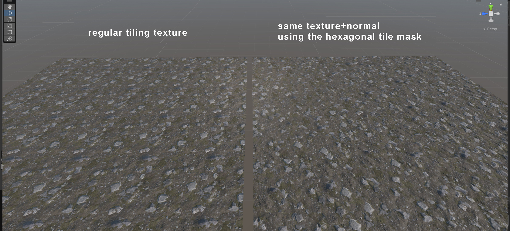

# hextilemask
Hiding texture tiling using a hexagonal tile mask

a Unity 2021.3.1f1 shadergraph to create non-repeating textures.

The paper that gave me the idea: (the graph is not an implementation of this):
[Practical Real-Time Hex-tiling](https://jcgt.org/published/0011/03/05/) - Morten S. Mikkelsen, Unity Technologies, USA

unity 6 version:

